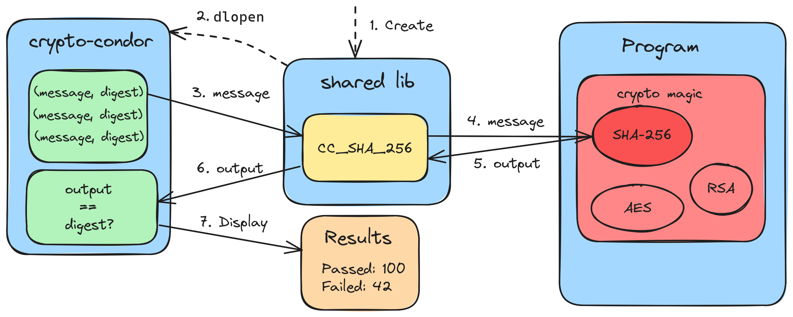

Harness API
===========

Inspired by fuzzing harnesses, |cc| can test implementation wrapped in a shared library.

 to use and returning the results.

    Illustration of the architecture of the harness mode.

How to use
----------

The idea is to create a shared library that interacts with the primitives to test. It
will expose some functions, whose name starts with ``CC``, that wrap a given operation
of the implementation. Their function signature is established by |cc| so that it can
run the functions with the corresponding test vectors.

How it works
------------

Internally, the library is first loaded with ``dlopen`` and its symbols examined with
`lief <https://lief.re/>`_. The functions whose name starts with ``CC`` are examined to
see if the full name matches a known pattern for the primitives that support this mode.
Those that match are passed to the corresponding modules, which run them with the test
vectors chosen by the function name.

Supported primitives
--------------------

.. toctree::
    :maxdepth: 1

    AES <AES>
    ChaCha20
    ECDH <ECDH>
    HMAC <HMAC>
    HQC <HQC>
    MLDSA
    MLKEM
    SHA
    SHAKE
